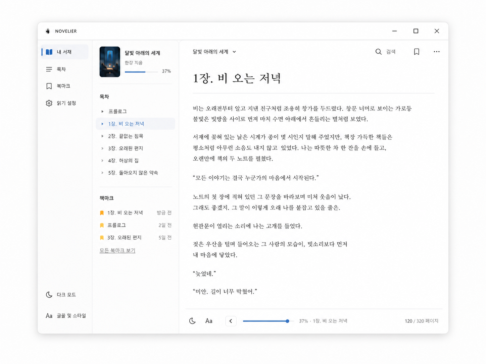

# NOVELIER UI 명세

> 기준 버전: v1
> 최종 갱신: 2026-07-25

## 1. 디자인 기준

다음 두 이미지는 레이아웃, 간격, 타이포, 아이콘 위치, 밝고 미니멀한
인상을 검증하기 위한 디자인 참고 자료다.

- [PC 참고 이미지](../image.png) — 1448×1086
- [모바일 참고 이미지](../image%20copy.png) — 941×1672




이미지는 구현 결과와 나란히 비교하되 런타임에서 읽거나 앱 패키지에
포함하지 않는다. 참고 화면의 저자와 장·목차 정보는 제품 요구사항이
아니다. NOVELIER v1에서는 다음과 같이 치환한다.

| 참고 이미지 요소 | NOVELIER v1 |
| --- | --- |
| 저자 | 표시하지 않음 |
| 장 제목·목차 | TXT 전체 연속 본문과 페이지/퍼센트 이동 |
| 사용자 표지 | 제목에서 결정적으로 생성한 로컬 표지 |
| 본문 장 제목 | 본문 첫 위치의 책 제목 `h1` 한 번만 표시 |

## 2. 경험 원칙

- **본문 우선:** 읽기 화면의 가장 강한 시각 요소는 제목과 본문이다.
- **조용한 도구:** 도구는 얇은 선, 낮은 대비, 넉넉한 여백을 사용하고
  선택 상태와 포커스에서만 강조색을 쓴다.
- **익숙한 플랫폼 동작:** 데스크톱은 패널과 키보드, 모바일은
  safe-area·바텀시트·시스템 뒤로가기를 우선한다.
- **안전한 투명도:** 표면만 투명해지고 본문과 조작 요소의 대비는
  유지된다.
- **지속되는 위치:** 레이아웃 변화가 독자의 문맥을 잃게 만들지 않는다.

## 3. 디자인 토큰

### 색상

| 토큰 | 밝음 | 용도 |
| --- | --- | --- |
| `--color-bg` | `#FCFCFB` | 앱과 본문 기본 배경 |
| `--color-surface` | `#FFFFFF` | 패널, 팝오버, 시트 |
| `--color-text` | `#181818` | 본문과 주요 레이블 |
| `--color-muted` | `#6E6E6E` | 보조 정보 |
| `--color-border` | `rgba(20,20,20,.10)` | 구분선 |
| `--color-accent` | `#2F7DD3` | 선택, 진행률, 포커스 |
| `--color-bookmark` | `#F4A61D` | 활성 북마크 |
| `--color-scrim` | `rgba(12,12,12,.28)` | 드로어·시트 뒤 가림막 |

테마 표면 기본값은 다음과 같다.

| 테마 | 배경 | 본문 | 보조 표면 |
| --- | --- | --- | --- |
| 밝음 | `#FCFCFB` | `#181818` | `#FFFFFF` |
| 세피아 | `#F3EBDD` | `#30281F` | `#F8F1E6` |
| 다크 | `#171717` | `#E8E4DE` | `#202020` |

경고와 오류는 색상만으로 구분하지 않고 아이콘과 설명을 함께 제공한다.

### 타이포

- UI: 운영체제 시스템 산세리프
- 본문과 책 제목: 앱에 오프라인 번들한 `Noto Serif KR`
- 폰트 파일과 SIL Open Font License는 배포물에 함께 포함
- 기본 본문: 데스크톱·모바일 `18px / 1.85`
- 사용자 글자 크기: `8px`부터 `36px`, 1px 단위
- 책 제목: 데스크톱 `36px / 1.3`, 모바일 `32px / 1.35`
- UI 기본: `14px / 1.4`; 보조 정보 `12px / 1.4`
- 한 줄 권장 길이: 한글 약 28~42자

사용자가 크기를 바꾸면 제목과 본문은 같은 비율이 아니라 각각의
가독성 범위 안에서 조절한다. 운영체제 200% 확대에서도 주요 조작이
잘리거나 겹치지 않아야 한다.

### 공간·형태·아이콘

- 공간 단위: 8px
- 데스크톱 앱 창 반경: 14px
- 선택 항목 반경: 8px
- 팝오버 반경: 12px
- 모바일 바텀시트 상단 반경: 24px
- 기본 구분선: 1px
- 조작 영역: 데스크톱 최소 `44×44px`, 모바일 최소 `48×48px`
- 아이콘: 동일한 1.75~2px 선형 아이콘 세트, 장식용 채움 혼용 금지
- 본문 좌우 여백: 데스크톱 48~64px, 태블릿 40px, 모바일 16~24px
- 모션: 120~180ms ease-out; `prefers-reduced-motion`에서는 이동
  애니메이션을 제거하고 상태를 즉시 전환

## 4. 반응형 레이아웃

| 뷰포트 | 레이아웃 | 규칙 |
| --- | --- | --- |
| `≥1180px` | 데스크톱 3단 | 1차 내비게이션 168px + 문맥 패널 280px + 리더 |
| `768~1179px` | 데스크톱/태블릿 2단 | 내비게이션과 문맥 패널을 280px 하나로 통합 |
| `<768px` 데스크톱 창 | 좁은 리더 | 데스크톱 타이틀바와 본문을 유지하고 기능을 최대 320px 드로어로 표시 |
| `430×760` 데스크톱 몰래보기 | 모바일형 미니 창 | 얇은 복구 레일 + 모바일 한 열 리더와 빠른 배경·복구 조작 |
| `<768px` 모바일 | 모바일 한 열 | 상단 바 + 본문 + 진행 영역 + 하단 도구 |

데스크톱 기본 창은 `1280×900`, 최소 창은 `720×560`이다. 리더 콘텐츠
열은 남은 폭 가운데에 최대 `720px`로 배치한다. 창이 최대화되면 외곽
반경과 외부 그림자를 제거한다. 네이티브 `720×560` 창은 모바일
툴바를 표시하지 않고 데스크톱 타이틀바, 320px 문맥 드로어와
간단보기 복구 동작을 유지한다. `430×760`은 사용자가 임의로 줄인 일반
창이 아니라 몰래보기에서만 사용하는 세션 전용 예외다.

## 5. 데스크톱 화면

### 앱 프레임

- 최상단 52px 영역에 NOVELIER 워드마크와 창 제어 영역을 둔다.
- Windows와 macOS 모두 드래그 가능한 프레임리스 사용자 지정
  타이틀바와 최소화·최대화·닫기 버튼을 오른쪽에 배치한다.
- 투명 모드에서는 타이틀바 배경, 외곽선, 그림자와 블러를 모두
  제거한다. 창 제어 아이콘과 본문 글자는 불투명하게 유지한다.
- 창 버튼, 검색 입력, 슬라이더에는 드래그 영역을 적용하지 않는다.

### 3단 구조

```text
┌──────────────┬──────────────────────┬──────────────────────────────┐
│ 1차 내비     │ 문맥 패널            │ 리더                         │
│ 168px        │ 280px                │ 남은 폭 / 본문 최대 720px    │
│              │                      │ 상단 바                       │
│ 내 서재      │ 선택 도구의 내용     │ 본문                          │
│ 페이지 이동  │                      │ 하단 진행/도구                │
│ 북마크       │                      │                              │
│ 읽기 설정    │                      │                              │
└──────────────┴──────────────────────┴──────────────────────────────┘
```

1차 내비게이션의 항목은 `내 서재`, `페이지 이동`, `북마크`,
`읽기 설정` 순서다. 선택 항목은 옅은 강조색 배경, 왼쪽 3px 표시선,
강조색 아이콘으로 나타낸다. 중복 기능을 만드는 패널 하단 빠른
진입점은 두지 않는다.

문맥 패널 상단에는 현재 책의 생성 표지, 제목, 진행률을 표시한다. 저자
행은 없다. 아래 영역은 선택한 도구에 따라 바뀐다.

- **내 서재:** 최근 책 목록, 현재 책 강조, 파일 가져오기
- **페이지 이동:** 읽기 방식 전환, 진행 슬라이더, 직접 페이지/퍼센트 이동
- **북마크:** 위치 미리보기와 생성 시각을 포함한 목록, 이동·삭제
- **읽기 설정:** 읽기 방식·글꼴·크기·행간과 초기화. 자간·문단
  간격·본문 폭·여백·글자 수 기준은 접힌 `고급 설정`에서 조절

2단 레이아웃에서는 1차 항목을 문맥 패널 상단의 아이콘 탭으로 합치고
현재 도구의 내용을 그 아래 표시한다. 좁은 레이아웃에서는 동일 내용을
왼쪽 드로어로 재사용한다.

### 간단보기

- 간단보기는 데스크톱의 1차 내비게이션과 문맥 패널을 접고 리더를
  남은 창 전체 폭으로 확장하는 지속 설정이다.
- 더보기의 통합 `화면 설정`과 `Cmd/Ctrl+Shift+S`에서 전환한다.
- 간단보기에서도 데스크톱 타이틀바와 리더 상단/하단 바를 유지한다.
  모든 chrome을 숨기는 집중 모드와 별개의 기능이다.
- 기본 보기로 복원하면 이전 도구 선택과 데스크톱 패널 구조가
  돌아오며, 안전 복구 단축키도 간단보기를 해제한다.

### 몰래보기 미니 창

- macOS·Windows 타이틀바에 아이콘과 글자가 함께 보이는 단일
  `몰래보기` 버튼을 제공한다. `Cmd/Ctrl+Shift+M`도 같은 상태를
  전환하며 다른 패널에 중복 버튼을 두지 않는다.
- 진입 직전 창 크기·위치·최대화 상태를 저장한 뒤 `430×760`
  모바일형 한 열 리더로 전환한다. 실제 iOS·Android UI에는 버튼과
  전용 단축키를 노출하지 않는다.
- 몰래보기는 일반 읽기·투명도 설정을 덮어쓰지 않는 세션 상태다.
  진입 시 배경 농도 28%, 간단보기와 항상 위를 자동 적용한다.
- 얇은 미니 창 레일에는 그립 아이콘과 `이동` 문구가 있는 최소
  `44×44px` 창 드래그 핸들, 배경 농도 슬라이더와 퍼센트,
  `창 안전하게 접기`, `일반 PC 보기로 돌아가기`를 둔다. 농도
  컨트롤의 휴지 상태 opacity는 현재 배경 alpha를 따르되 완전
  소실을 막는 `4%` 하한을 적용하고, hover·focus 시 최소 `78%`로
  드러나 다시 조절할 수 있게 한다. 본문 글자와 다른 아이콘은
  불투명을 유지한다. 그립의 아이콘이나 문구 어느 부분을 잡아도
  창 전체가 이동해야 한다. 본문 중앙 클릭으로 chrome을 숨기면 이
  빠른 설정 레일도 함께 투명해지고 내부 컨트롤을 제거하되 52px
  상단 복구 영역은 유지한다. 그 영역을 클릭하거나 키보드로 실행하면
  빠른 설정 레일과 나머지 chrome을 함께 다시 표시한다.
- 화면의 접기 버튼과 전역 `Cmd/Ctrl+Shift+H`는 창을 완전히 숨기지
  않고 네이티브 최소화한다. 같은 단축키 또는 Dock/작업 표시줄에서
  항상 복구할 수 있다.
- 일반 PC 창 복원 버튼, `Cmd/Ctrl+Shift+M` 또는
  `Cmd/Ctrl+Shift+0`으로 저장한 geometry와 일반 데스크톱 UI를
  복원한다. 몰래보기 중 새로고침해 세션 상태가 해제되어도 저장한
  geometry를 먼저 복구해 작은 창에 갇히지 않게 한다.
- chrome이 숨겨진 동안 실제 상단 바와 하단 진행·도구 바가 차지하던
  높이에만 투명 복구 버튼을 둔다. 본문 좌우 클릭은 이전·다음 읽기
  단위로 이동하고, 가운데 클릭은 보이는 chrome을 숨기되 숨겨진
  chrome을 다시 열지 않는다. 몰래보기에서는 창 최상단 빠른 설정
  레일까지 함께 숨기며 그 레일 자체를 클릭해야 다시 표시한다.
  상·하단 복구 버튼은 해당 가장자리에서 페이지 이동보다 우선하고
  가로 스와이프는 그대로 유지한다.

### 리더 상단 바

- 왼쪽: 현재 책 제목과 아래 방향 아이콘. 누르면 최근 책 전환 팝오버
- 오른쪽: 검색, 현재 위치 북마크 토글, 더보기
- 검색은 아이콘 클릭 또는 `Cmd/Ctrl+F`로 읽기 도구 dialog를 열고,
  검색어가 포함된 짧은 문맥과 진행률 목록을 제공한다.
- 일반 PC 더보기에는 `책 정보`, 통합 `화면 설정`, `집중 모드`만
  표시한다. 검색과 읽기 통계는 모바일·몰래보기에서 더보기에
  유지하며 PC에서는 상단 검색과 진행 정보로 접근한다.

### 본문

- 본문 첫 위치에서만 책 제목을 큰 `h1`으로 표시하고 얇은 구분선을 둔다.
- 이후 페이지나 스크롤 위치에는 제목을 반복하지 않는다.
- 빈 줄과 문단 경계를 보존하되 과도한 연속 빈 줄은 레이아웃을
  깨뜨리지 않도록 정규화한다.
- 본문 텍스트의 브라우저 선택과 선택문 네이티브 드래그는 모든 읽기
  방식에서 차단한다. 화면 낭독과 본문 검색용 텍스트 구조는 유지하되
  첫 버전에서는 본문 복사 선택과 운영체제 사전 조회를 제공하지 않는다.
- 일반 PC·모바일·몰래보기 모두 중앙 영역의 짧은 클릭/탭은 보이는
  chrome을 숨기기만 한다. 숨겨진 chrome은 실제 상단 또는 하단
  조작 영역을 눌러야 다시 표시되며 본문 중앙·좌·우 탭으로는 열리지
  않는다. 스크롤, 링크·버튼 조작, 스와이프·드래그 직후에는 어느
  모드에서도 전환하지 않는다.
- 집중 모드에서는 상단/하단 바와 패널을 숨기고 본문 폭과 현재 위치를
  유지한다. `Cmd/Ctrl+Shift+F` 또는 중앙 탭으로 복원한다.
- 집중 모드는 리더 뷰포트의 폭과 높이를 확장하되 모바일에서는
  상단 safe-area와 `--reader-safe-area-bottom` 구조 행을 유지한다.
  따라서 가로 페이지와 세로 스크롤의 소설 본문 자체가 시스템 상태바나
  내비게이션 바 뒤로 들어가지 않는다. 해제 후 첫 가시 문단을 전환 전
  위치의 ±1문단 안으로 복원한다.

### 가로 페이지 모드

- 방향키 좌/우, 화면 좌/우 탭 영역, 휠의 수평 의도, 좌우 스와이프,
  이전/다음 버튼을 지원한다.
- 페이지는 원문 문자열을 복제하지 않는 UTF-16 반열림 offset
  범위이며 Unicode grapheme와 인접 문단 경계를 안전하게 지킨다.
  리더 DOM에는 현재 페이지 범위만 렌더링한다.
- 문자 수 기반 1차 페이지 계산 후 현재 DOM의 `h1`·본문 각 줄
  사각형을 다시 측정한다. 마지막 줄의 하단이 본문 경계 안에 완전히
  들어오지 않으면 페이지 용량을 낮춰 그 줄 전체를 다음
  페이지로 보낸다. 부분 줄을 `overflow: hidden`으로 가리는 상태는
  승인하지 않는다.
- 상·하단 UI 표시/숨김, 글꼴 로드, 글꼴·행간 변경, 회전과 리사이즈
  후마다 재측정하며, 재계산된 offset 범위는 연속적이어서 문장을
  건너뛰지 않는다.
- 화면 가장자리 탭 영역은 중앙 집중 모드 영역과 겹치지 않게 좌우 각
  20%로 제한한다.
- 페이지 이동 중 120~180ms 변환을 사용하되 reduced-motion에서는
  즉시 교체한다.
- 페이지 재계산 중에는 이전 전체 페이지 수 대신 `페이지 계산 중`을
  표시하고 직접 페이지 입력을 잠그되 offset 기반 현재 위치는 유지한다.

### 세로 스크롤 모드

- 문단 단위 가상화를 사용하고 기본 브라우저 스크롤, 휠,
  PageUp/PageDown, Space/Shift+Space를 지원한다.
- 현재 구현은 기준 문단 앞 10개와 뒤 48개를 overscan해 최대 59개
  문단만 마운트한다. 위·아래 spacer가 전체 스크롤 높이를 유지하며
  첫 가시 문단의 전역 문자 offset을 저장한다.
- 3,000문단 승인 fixture는 이동 전후 실제 문단 DOM이 240개 이하인지
  검사한다. 240은 회귀 테스트의 여유 상한이고 구현 계약은 최대
  59개다.
- 스크롤바는 보이되 테마에 맞춰 낮은 대비로 표현한다.
- 진행 정보는 현재/전체 글자 수를 우선 표시한다.

### 리더 하단 바

- 왼쪽: 이전/다음
- 중앙: 진행 슬라이더와 진행률 및 현재 위치 요약
- 오른쪽: 가로 모드는 `현재 / 전체 페이지`, 세로 모드는
  `현재 / 전체 글자`
- 테마와 글꼴의 중복 빠른 진입점은 두지 않고 `화면 설정`과
  `읽기 설정`으로 모은다.
- 진행 정보를 누르면 페이지, 퍼센트, 공백 포함/제외 글자 수를 모두
  담은 작은 통계 팝오버를 연다.

## 6. 모바일 화면

모바일은 운영체제 상태바와 홈 인디케이터를 그리지 않는다. 최상단과
최하단은 `env(safe-area-inset-*)`를 사용한다.

```text
┌────────────────────────────┐
│ 뒤로   책 제목 ▾    ☆  ⋯  │  상단 리더 바
├────────────────────────────┤
│                            │
│ 책 제목                    │
│ ─────────────────────────  │
│ 본문                       │
│                            │
├────────────────────────────┤
│ 진행 슬라이더 / 위치 정보  │
├────────────────────────────┤
│ 이동 북마크 밝기 글꼴 테마 │  하단 도구
└────────────────────────────┘
```

### 상단 리더 바

- 왼쪽 뒤로가기는 서재로 이동한다.
- 가운데 책 제목은 한 줄 말줄임하며 최근 책 팝오버를 연다.
- 오른쪽에는 현재 위치 북마크 토글과 더보기를 둔다.
- 더보기에는 검색, 책 정보, 읽기 통계, 집중 모드를 배치한다.

### 본문과 진행 영역

- 기본 좌우 여백은 20px이며 작은 화면에서는 16px까지 줄인다.
- 본문 첫 위치의 제목 아래 구분선과 문단 간격은 참고 이미지의 리듬을
  따른다.
- 진행 영역은 슬라이더 한 줄과 진행률/위치 정보 한 줄로 구성한다.
- 가로 모드에서는 페이지, 세로 모드에서는 글자 수를 우선 표시한다.
- 본문 중앙 탭은 보이는 상·하단 UI를 숨기기만 하며, 숨겨진 UI를 다시
  열지 않는다.
- 숨겨진 UI는 실제 상단 바 또는 하단 진행·도구 바가 차지하는 높이의
  투명 호출 영역을 탭했을 때만 다시 표시한다. 본문 좌·우 페이지 이동
  영역과 중앙 본문 영역은 UI 표시 상태를 바꾸지 않는다.

### 하단 도구와 바텀시트

하단 도구는 `이동`, `북마크`, `밝기 설정`, `글꼴`, `테마` 순서다.
각 항목은 24px 아이콘, 짧은 레이블, 최소 48px 터치 영역을 갖는다.
Android에서는 현재 system/navigation bar, 숨겨진 상태를 포함한 안정
navigation bar, tappable element, mandatory gesture inset 중 가장 큰
값을 네이티브 safe-area로 사용한다. OEM이 양수 inset을 작게 보고해도
48px 보호값을 해제하지 않고, 진행 정보와 도구 라벨에는 추가 12px를
더해 최소 60px의 하단 여유를 항상 확보한다. 세로·가로 회전과
bridge 준비 전후에도 같은 규칙을 적용한다.
상·하단 chrome을 숨겼을 때도 이 하단 여유를 0으로 접지 않는다.
리더 grid의 마지막 행으로 유지해 가로 페이지와 세로 스크롤 본문
뷰포트의 경계를 시스템 내비게이션 위에서 물리적으로 끝낸다. 이는
문서 끝에만 padding을 붙이는 방식이 아니므로 현재 스크롤 위치와
관계없이 동일하게 적용된다.
휴대폰 가로 화면에서는 3버튼 내비게이션이 회전 방향에 따라 왼쪽
또는 오른쪽으로 이동할 수 있으므로 양쪽에 각각 48px 보호값과 12px
여유를 적용한다. 본문, 진행 슬라이더·페이지 정보, 상단 바와 하단
도구를 모두 이 좌우 보호 영역 안쪽에 배치한다.

- **이동:** 읽기 방식과 페이지/퍼센트 이동
- **북마크:** 목록, 현재 위치 추가/삭제
- **밝기 설정:** 시스템 밝기가 아닌 앱 본문 디밍 조절
- **글꼴:** 글꼴, 크기, 행간, 자간, 문단 간격
- **테마:** 밝음, 세피아, 어두움

항목은 화면 아래에서 올라오는 바텀시트를 열며 한 번에 하나만 열린다.
시트는 제목, 닫기 버튼, 드래그 핸들을 제공하고 배경 스크롤을 잠근다.
바깥 영역 탭, 아래로 스와이프, Escape, Android 뒤로가기로 닫는다.

화면 높이가 520px 이하인 휴대폰 가로 화면에서는 하단 레이블을 숨기고
아이콘과 접근성 이름만 유지한다. 본문은 가로 회전에서도 한 열이다.

## 7. 서재

- 데스크톱은 앱 프레임과 내비게이션을 유지하고 메인 영역에 책 카드를
  배치한다.
- 모바일은 단일 열 상단 바 아래에 최근 읽은 순서의 책 목록을 표시한다.
- 책 카드는 생성 표지, 제목, 진행률, 최근 읽은 시각을 제공한다.
- 첫 실행 빈 상태에는 TXT 가져오기 버튼, 로컬 전용 안내, 지원
  인코딩·50MB 제한을 간결하게 표시한다.
- 가져오기 버튼은 명시적 사용자 조작으로만 파일 선택기를 연다.
- 책 삭제는 확인을 거치며 책, 본문 블록, 위치, 북마크를 함께 삭제한다.

### 생성 표지

- 제목 문자열 해시로 미리 정한 접근성 검증 팔레트 중 하나를 선택한다.
- 중앙에는 최대 두 줄 제목을 표시하고 필요하면 말줄임한다.
- 같은 제목은 모든 플랫폼과 재실행에서 같은 표지를 만든다.
- 네트워크 이미지나 사용자 파일은 사용하지 않는다.

## 8. 페이지 이동과 상태 표현

### 가로 모드

- 진행 슬라이더
- `현재 페이지 / 전체 페이지`
- 숫자 직접 입력과 이동 버튼
- 처음/마지막 이동

입력은 `1..전체 페이지` 범위로 clamp한다. 페이지 재계산 중에는
입력과 이동 버튼을 잠그고 새 전체 페이지 수가 준비된 뒤 다시 연다.

### 세로 모드

- 진행 슬라이더
- `0..100%` 직접 입력과 이동 버튼
- 처음/마지막 이동
- 현재/전체 글자 수

### 공통 상태

- **가져오는 중:** 파일명이나 본문을 노출하지 않는 진행 표시
- **인코딩 확인:** 짧고 로컬에서 생성한 미리보기와 인코딩 선택
- **중복:** 기존 책 열기 또는 가져오기 취소
- **너무 큰 파일:** 50MB 제한과 파일을 나누라는 안내
- **빈 파일/디코딩 실패:** 서재로 안전하게 돌아가는 오류
- **페이지 계산 중:** 이전 전체 페이지 수 숨김
- **검색 결과 없음:** 검색어를 유지한 채 빈 결과 설명
- **저장 실패:** 읽기는 유지하고 재시도 가능한 알림

## 9. 설정과 투명 모드

### 읽기 설정

- 읽기 방식: 가로 페이지 / 세로 스크롤
- Android 앱: 선택형 `음량 버튼으로 페이지 넘기기`
  (올림: 이전, 내림: 다음). 신규·마이그레이션 기본값은 켜짐
- 본문 글꼴
- 글자 크기 `8..36px`
- 행간
- 접힌 고급 설정: 자간, 문단 간격, 본문 최대 폭과 좌우 여백,
  글자 수 공백 포함/제외
- 더보기 메뉴의 확인형 `읽기 설정 초기화`

설정은 조작 즉시 적용하되 위치 locator를 먼저 캡처한다. 초기화는
확인 후 글꼴 18px·밝은 테마·가로 페이지·Android 음량키 켜짐으로
돌아가며 책·북마크·읽던 위치는 유지한다.

### 밝기와 데스크톱 창 투명도

- **밝기:** 앱 콘텐츠 위 디밍 레이어 값이며 시스템 밝기를 바꾸지 않는다.
- **창 투명도:** macOS/Windows의 단일 배경 표면 alpha를 0~100%로
  조절한다. 0%에서는 배경 없이 글자·아이콘만 남는다.
- 일반 PC의 통합 `화면 설정`은 테마, 앱 밝기, 간단보기와
  `기본 100 / 은은 82 / 투명 55 / 완전 0%` 배경 프리셋을 제공한다.
  100%를 고르면 투명 모드를 끄고 나머지 프리셋은 자동으로 켠다.
- 일반 PC의 항상 위 조작은 제거하고 몰래보기에서 자동 적용한다.
- 본문, 아이콘, 포커스 링은 alpha 조절 대상에서 제외한다.
- 투명 모드에서는 하위 패널에 alpha를 반복 적용하지 않으며 외곽선,
  네이티브 그림자, 프레임 블러와 전체 창 밝기 사각형을 제거한다.
- 모바일은 실제 창 투명도·항상 위를 노출하지 않고 반투명 툴바와
  바텀시트로 대체한다.
- `Cmd/Ctrl+Shift+T`는 데스크톱 투명 모드를 전환한다.
- `Cmd/Ctrl+Shift+M`은 세션 전용 몰래보기 미니 창을 전환한다.
- `Cmd/Ctrl+Shift+H`는 포커스와 무관하게 데스크톱 창을 안전하게
  최소화하거나 복구한다.
- `Cmd/Ctrl+Shift+0`은 몰래보기를 해제하고 저장한 일반
  창 geometry와 불투명 기본 표시를 한 번에 복원하는 안전 동작이다.

## 10. 입력과 접근성

| 입력 | 동작 |
| --- | --- |
| `←` / `→` | 가로 모드 이전/다음 페이지 |
| `PageUp` / `PageDown` | 읽기 방향에 맞춰 이전/다음 구간 |
| `Space` / `Shift+Space` | 세로 모드 아래/위 화면 |
| Android `음량 올림` / `음량 내림` | 옵션을 켠 활성 리더에서 이전/다음 읽기 구간 |
| `Cmd/Ctrl+F` | 본문 검색 |
| `Cmd/Ctrl+Shift+F` | 집중 모드 전환 |
| `Cmd/Ctrl+Shift+M` | 데스크톱 몰래보기 미니 창 / 일반 PC 창 전환 |
| `Cmd/Ctrl+Shift+H` | 데스크톱 창 전역 안전 접기 / 복구 |
| `Cmd/Ctrl+Shift+S` | 데스크톱 간단보기 / 기본 보기 전환 |
| `Cmd/Ctrl+Shift+T` | 데스크톱 투명 모드 전환 |
| `Cmd/Ctrl+Shift+0` | 몰래보기와 창 geometry를 포함한 안전 복구 |
| `Escape` | 팝오버/시트/드로어/검색 → 몰래보기 순서로 복구 |

- 모든 아이콘 버튼에는 화면에 보이는 tooltip과 접근성 이름을 제공한다.
- 포커스는 2px 강조색 링으로 표시하고 키보드만으로 모든 기능을
  사용할 수 있어야 한다.
- 바텀시트와 팝오버는 포커스를 가두고 닫힌 뒤 실행 버튼으로 복원한다.
- Android 음량 키는 리더가 전면에 있고 시트·대화상자가 없을 때만
  캡처한다. 키를 길게 눌러도 한 번만 이동하며, 옵션 해제·서재·
  백그라운드에서는 시스템 음량 조절로 되돌린다.
- iOS에는 공개된 물리 음량 키 이벤트가 없으므로 해당 설정을 표시하지
  않는다. 시스템 음량 변화 관찰이나 숨은 슬라이더 재설정은 사용하지
  않는다.
- 선택, 북마크, 오류, 진행률은 색상 외에 아이콘·텍스트·형태로도
  전달한다.
- 현재 위치의 잦은 자동 저장은 스크린리더 live region으로 알리지 않는다.
- 애니메이션 감소, 고대비 모드, VoiceOver, TalkBack을 검증한다.

## 11. 시각 승인 체크리스트

다음 크기에서 자동 스냅샷과 수동 비교를 모두 수행한다.

- 데스크톱: `1280×900`, `1024×768`, `800×600`
- 데스크톱 몰래보기: 자동 스냅샷 `430×720`, 네이티브 수동 `430×760`
- 모바일 세로: `390×844`, `430×932`
- 모바일 가로: 높이 520px 이하의 대표 iOS/Android 뷰포트

승인된 자동 기준 이미지는
`tests/responsive-reader.spec.ts-snapshots/`에 보관하며 원본 참고
이미지와 별개의 구현 회귀 기준으로 사용한다.

현재 Playwright discovery는 여섯 프로젝트의 78개 case다. 프로젝트와
화면 범위가 맞는 43개는 실행 통과했고 해당 플랫폼 계약이 아닌
프로젝트의 35개는 의도적으로 skip한다. 여기에 가로↔세로 ±1문단,
집중 모드 뷰포트 확장·위치 복귀, 3,000문단 DOM 상한, 다이얼로그
초기 포커스·Escape·실행 버튼 복원, 네이티브 `720×560` 드로어 계약이
포함된다.

각 화면에서 확인할 항목:

- 패널 폭, 본문 최대 폭, 행 길이와 좌우 여백
- 제목·본문·보조 텍스트의 위계
- 상단 도구와 하단 진행/도구의 정렬
- 선택, hover, focus-visible, disabled, loading, error 상태
- 밝음·세피아·어두움 테마의 대비
- safe-area, 키보드 표시, 회전, 200% 확대 시 겹침 여부
- 집중 모드 전환 전후의 본문 위치 유지
- 참고 이미지와 같은 조용한 밀도와 불필요한 장식의 부재
